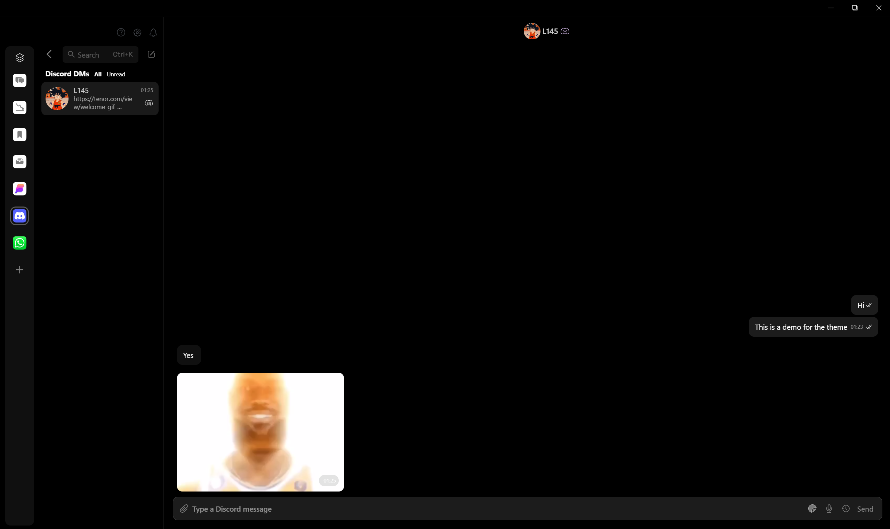

# Darker - Beeper Desktop Custom CSS Theme

**Apply Instantly in Settings**:  
Beeper → Settings → Appearance → **Custom CSS** → Paste the CSS code → **Apply**

This project is a custom theme for Beeper Desktop. It modifies the appearance of the Beeper app, giving it a fresh, sleek, pure black look.

### ⚠️ Note

Beeper Desktop v3.0 only
This theme only looks nice when dark mode is enabled!

## Features

- **Clean UI**: Gives Beeper a modern and minimal design.
- **Battery Friendly**: Great for your laptop's battery life since it's pure black (#000000).
- **Easy to Apply**: Just copy-paste the CSS – no coding needed.
- **No Performance Impact**: Pure CSS, no scripts.

## How to Use (Beeper Desktop)

1. Open Beeper.
2. Go to **Settings → Appearance → Custom CSS**.
3. Paste the CSS from this repo into the textbox.
4. Click **Apply**.

That’s it. Your Beeper now has a custom look.

## Contact

Got feedback or want to suggest improvements?

- Email: business@l145.be
- LinkedIn: [Aryan Shah](https://www.linkedin.com/in/aryan-shah-l145)
- GitHub: [legelff](https://github.com/legelff)
